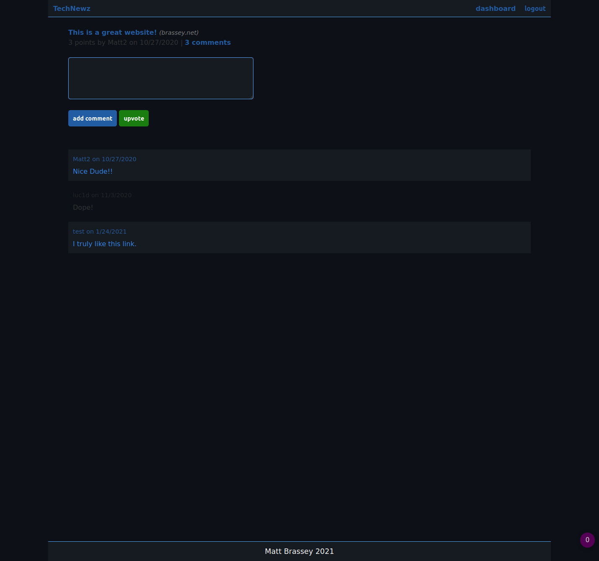
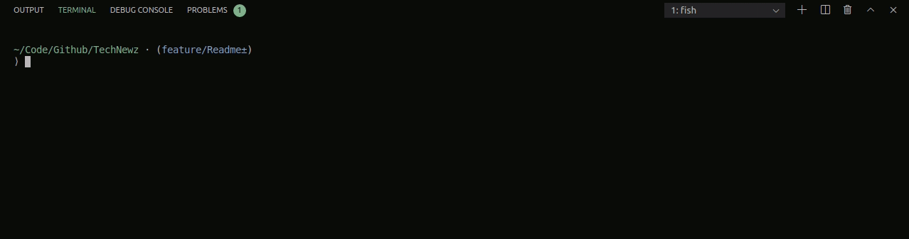
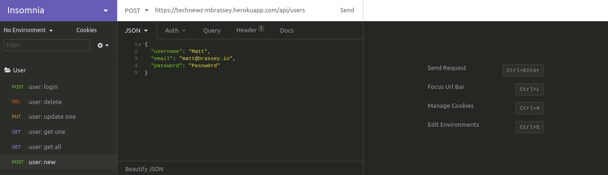
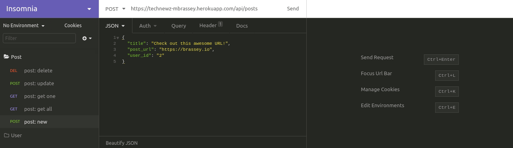
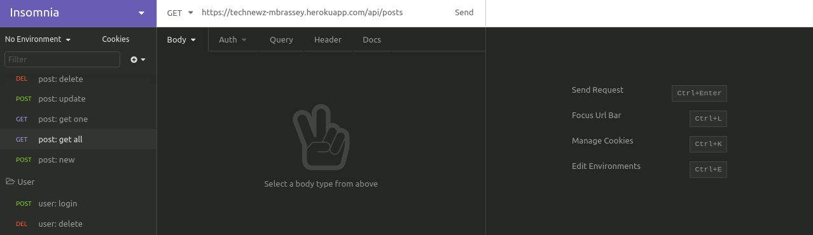

## TechNewz

Full stack "Hacker News" type blog application utilizing ORM with Sequelize and adhering to the Model View Controller methodology. On the back end, Express.js and SQL database are being used to provide robust REST API with multiple endpoints/routes. Routes include POST, PUT, GET & DELETE for Users, Posts and Comments. Authentication is required for the appropriate routes and user passwords are encrypted within the database using bcrypt. All routes are tested in the demonstrations below. Test Driven Development has been practiced using Jest.

#### Issues

- [x] [Users can create, read, update, and delete a profile](https://github.com/MBrassey/TechNewz/issues/1)
- [x] [Add security and authentication](https://github.com/MBrassey/TechNewz/issues/2)
- [x] [Create and manipulate posts](https://github.com/MBrassey/TechNewz/issues/3)
- [x] [Enable users to vote on posts](https://github.com/MBrassey/TechNewz/issues/4)
- [x] [Create and manipulate comments on post data](https://github.com/MBrassey/TechNewz/issues/5)
- [x] [Generate Readme & Deploy Heroku](https://github.com/MBrassey/TechNewz/issues/6)
- [x] [Create Homepage](https://github.com/MBrassey/TechNewz/issues/7)
- [x] [Create Login and Signup Page](https://github.com/MBrassey/TechNewz/issues/8)
- [x] [Create Single Post Page](https://github.com/MBrassey/TechNewz/issues/9)
- [x] [Create Dashboard for Authenticated Users](https://github.com/MBrassey/TechNewz/issues/10)

#### Table of Contents

- [Requirements](#Requirements)
- [Installation](#Installation)
- [Usage](#Usage)
- [Screenshots](#Screenshots)
- [Questions](#Questions)
- [License](#License)

#### Requirements

    mysql or jawsdb
    node
    npm

#### Installation

    Create file: .env (in root directory)
        DB_NAME='<your_database_name>'
        DB_USER='<your_user_name>'
        DB_PW='<your_mysql_password>'

    npm i
    npm run migrate

#### Usage

    Usage: node server.js [ -h | -v | -l | -a ]
    or: npm start

    [options]

           -h          Display this message.
           -v          Show version.
           -l          Show license info.
           -a          What is TechNewz?

<h6>
:cyclone: Click the image(s) below to view the live <a id="Screenshots" href="https://technewz-mbrassey.herokuapp.com/">webapplication</a>
</h6>

> Setup
> 

> User Routes
> 

> Post Routes
> 

> Comment Routes
> 

#### Questions

Contact me at [matt@brassey.io](mailto:matt@brassey.io) with any questions or comments.

#### License

`TechNewz` is published under the **CC0_1.0_Universal** license.

> The Creative Commons CC0 Public Domain Dedication waives copyright interest in a work you've created and dedicates it to the world-wide public domain. Use CC0 to opt out of copyright entirely and ensure your work has the widest reach. As with the Unlicense and typical software licenses, CC0 disclaims warranties. CC0 is very similar to the Unlicense.
